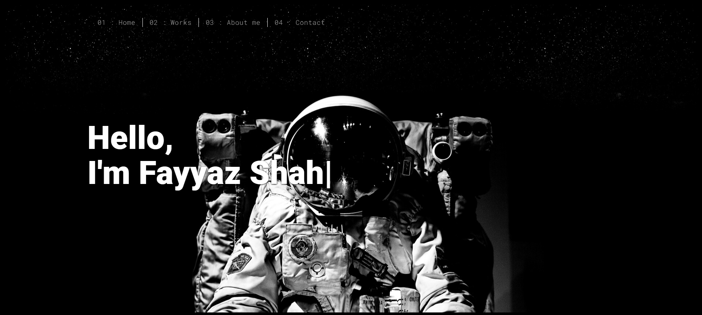
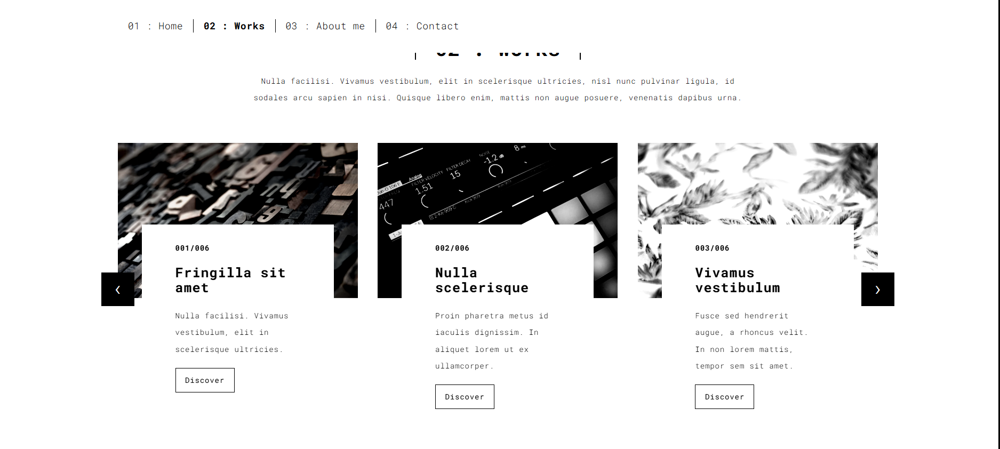

# 💼 Flask Portfolio Web App

A simple **Flask portfolio website** with a contact form that stores user submissions in a CSV file.

---

## 🛠️ Technologies Used

- Python 3.11
- Flask
- CSV module
- Docker (for containerization)
- HTML/CSS for templates

---

## 🚀 Features

- Home page and multiple HTML pages
- Contact form with data stored in CSV
- Redirects to a thank-you page after form submission
- Simple, clean portfolio layout

---

## 🖼️ UI 




---

## 📂 Project Structure
```bash
flask-portfolio/
├── app.py
├── templates/
│ ├── index.html
│ ├── contact.html
│ └── thankyou.html
├── database.csv
├── requirements.txt
├── Dockerfile
├── docker-compose.yml
└── README.md
```

---

## ⚡ Setup and Usage

1. Install dependencies:

```bash
git clone https://github.com/Fayyaz6137/Web-Portfolio-Flask.git

cd web-portfolio-flask

pip install -r requirements.txt
```

2. Run the script locally:

```bash
python app.py
```

3. Open a browser and visit:

```bash
http://localhost:5000
```

---

## 🐳 Run With Docker

Build and start the container:
```bash
docker compose up --build
```
Access the portfolio in your browser at:
```bash
http://localhost:5000
```

---


## 📚 What I Learned

* Building web applications with Flask
* Routing and dynamic page rendering
* Handling form submissions
* Storing form data in CSV
* Containerizing Flask apps with Docker

---

## 🔮 Future Improvements

* Add email notifications on form submission
* Use a database (SQLite/PostgreSQL) instead of CSV
* Add a contact form validation
* Deploy the portfolio online (Heroku, AWS, or Docker container)